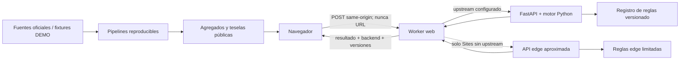

# Cifra Cívica

Cifra Cívica es un simulador fiscal cívico, neutral y centrado en España. Permite comparar la legislación de referencia con escenarios de política pública y entender el cambio estimado en la renta disponible de un hogar. También ofrece contexto territorial sin mezclar datos personales con estadísticas agregadas.

> Este simulador ofrece una estimación con fines informativos. No es una declaración tributaria, asesoramiento jurídico ni un cálculo oficial de una administración pública.

El producto está pensado para su uso público en el ciclo electoral español de 2027. La cobertura de cada ejercicio, territorio y escenario depende exclusivamente de las versiones publicadas y validadas en el registro de políticas; una fecha de campaña no convierte una propuesta incompleta en una regla calculable.

## Estado y garantías

El repositorio implementa un MVP orientado a producción, pero cada escenario conserva su propio estado de validación. Los fixtures de desarrollo se muestran como `DEMO — escenario sintético` y no representan propuestas de partidos.

- Sin cuenta obligatoria ni perfiles políticos.
- Cálculos personales efímeros: no se persisten cuerpos de petición o respuesta.
- El navegador nunca contiene ni ejecuta aritmética fiscal: usa un `POST` del mismo origen.
- Motores deterministas identificados en cada resultado; ninguna IA generativa modifica importes.
- Fuentes, supuestos, cobertura, incertidumbre y versiones visibles.
- Navarra y País Vasco no reciben reglas de territorio común por sustitución.
- Sin publicidad conductual, píxeles políticos, session replay ni recomendación de voto.
- Objetivo de accesibilidad WCAG 2.2 AA.

## Arquitectura

| Componente | Ubicación | Responsabilidad |
| --- | --- | --- |
| Web | raíz / `app/` | Interfaz Next/React, flujos y explicaciones |
| Worker web | `worker/` | Ruta del mismo origen, límites, cabeceras y proxy sin persistencia |
| API de simulación | `services/simulation-api/` | Contrato canónico FastAPI y motor Python principal |
| Contingencia edge | `lib/edge-simulation-api.ts` | Implementación aproximada, server-side y visiblemente etiquetada para Sites sin upstream |
| Registro de políticas | `policy-registry/` | Reglas, parámetros, fuentes y estados versionados |
| Geografía y publicación | `packages/geography/`, `pipelines/` | Fixtures, controles de divulgación y teselas |
| Documentación y gobierno | `docs/` | Método, validación, privacidad, seguridad y operaciones |

El flujo personal y el agregado están separados:



Con `SIMULATION_API_BASE_URL` configurada, el Worker usa exclusivamente FastAPI y devuelve un error seguro si el upstream falla; no cambia de motor a mitad de una petición. Un despliegue Sites sin upstream usa la contingencia edge de forma deliberada, con `calculationBackend=edge_api`, model version propia y advertencia visible. Nunca existe fallback aritmético en el bundle del navegador.

Más detalle en [arquitectura](docs/architecture.md) y en los [ADR](docs/adr/).

## Inicio rápido

Requisitos para ejecución nativa:

- Node.js 22.13 o posterior
- Python 3.12 o posterior
- GNU Make

```bash
cp .env.example .env
make setup
make dev
```

La web queda en [http://localhost:3000](http://localhost:3000), la API en [http://localhost:8000](http://localhost:8000) y su documentación OpenAPI en [http://localhost:8000/api/v1/docs](http://localhost:8000/api/v1/docs). Para el entorno en contenedores:

```bash
cp .env.example .env
make up
```

No use datos personales reales en entornos compartidos de desarrollo.

## Comandos

| Comando | Finalidad |
| --- | --- |
| `make setup` | Instalar dependencias web y Python |
| `make dev` | Ejecutar web y API localmente |
| `make test` | Ejecutar las suites web, API, geografía y gobierno |
| `make lint` | Lint y comprobación de tipos |
| `make policy-validate` | Validar esquema, fuentes y reglas de publicación |
| `make model-study` | Ejecutar el laboratorio estadístico completo (2M hogares sintéticos) |
| `make benchmark` | Ejecutar benchmarks disponibles |
| `make seed` | Generar fixtures geográficos DEMO deterministas |
| `make tiles` | Construir el artefacto local de teselas |
| `make build` | Crear la web de producción y validar el API |
| `make privacy-check` | Buscar regresiones de logging, URLs y tracking |
| `make up` / `make down` | Levantar o detener Docker Compose |

`make help` muestra la lista vigente.

## Verificación antes de publicar

```bash
make ci
```

Una publicación no debe etiquetarse como validada si faltan fuentes, casos dorados o metodología. El CI también comprueba límites de privacidad, contratos, accesibilidad si existe su suite, imágenes de contenedor y metadatos de versión.

## Documentación

- [Mapa de documentación](docs/README.md)
- [Metodología del modelo](docs/methodology/model.md)
- [Inventario y conteos auditables del modelo](docs/methodology/model-inventory.md)
- [Fuentes y procedencia](docs/methodology/data-sources.md)
- [Diccionario de datos](docs/data-dictionary/README.md)
- [Guía para autorar políticas](docs/policy-authoring.md)
- [Plan de validación](docs/validation/validation-plan.md)
- [Limitaciones conocidas](docs/methodology/limitations.md)
- [Privacidad y evaluación de impacto](docs/privacy/README.md)
- [Modelo de amenazas](docs/security/threat-model.md)
- [Despliegue](docs/deployment.md) y [operaciones](docs/operations.md)
- [Accesibilidad](docs/accessibility.md)
- [Correcciones y feedback](docs/feedback-corrections.md)
- [Historial de cambios](CHANGELOG.md)

## Contribuir y seguridad

Lea [CONTRIBUTING.md](CONTRIBUTING.md) antes de proponer cambios. Los problemas de seguridad se notifican de forma privada siguiendo [SECURITY.md](SECURITY.md); no incluya datos fiscales personales en issues, fixtures ni capturas.

## Licencia

Código y documentación bajo licencia MIT, salvo conjuntos de datos o materiales de terceros que indiquen condiciones distintas. Consulte [LICENSE](LICENSE) y el [inventario de terceros](docs/security/third-party-inventory.md).
