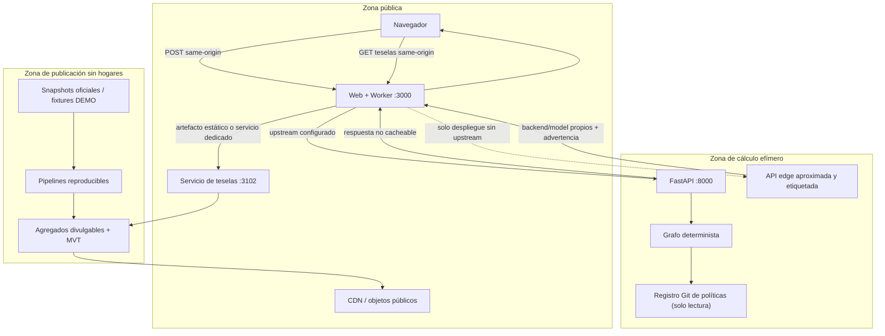

# Arquitectura del sistema

## Objetivos

Cifra Cívica separa presentación, cálculo personal, registro de políticas y publicación geográfica. La arquitectura prioriza reproducibilidad, denegación segura y ausencia de persistencia personal sobre optimizaciones prematuras.

## Vista de componentes



El Worker expone el contrato canónico bajo el mismo origen que la web. Cuando existe `SIMULATION_API_BASE_URL`, solo actúa como proxy hacia FastAPI y falla cerrado ante timeout o indisponibilidad; no cambia automáticamente al motor edge. La contingencia edge se activa únicamente en un despliegue deliberado sin upstream, como Sites, se ejecuta en servidor y se etiqueta `edge_api`. No hay motor fiscal en el bundle cliente. Ninguna ruta escribe perfiles, historiales o resultados, y los pipelines agregados nunca consumen peticiones personales.

## Límites de confianza

1. **Navegador**: controla entradas y guardado local explícito; se considera no confiable para validación.
2. **Worker same-origin**: aplica método/tamaño, no registra el cuerpo, conserva `no-store` y enruta a un backend fijo por despliegue.
3. **API y motores**: FastAPI aplica esquema, timeout y reglas versionadas; la contingencia edge repite el contrato estricto, declara menor cobertura y nunca se presenta como equivalente validado.
4. **Motor y registro**: artefactos inmutables de release, montados en solo lectura; una política no publicada no cruza la puerta de producción.
5. **Publicación de datos**: procesa exclusivamente fuentes autorizadas o fixtures DEMO; aplica supresión antes de crear teselas.
6. **Operación**: métricas y logs contienen datos técnicos de baja cardinalidad, nunca hechos del hogar.

## Flujo de cálculo personal

```mermaid
sequenceDiagram
  participant U as Persona
  participant B as Navegador
  participant W as Worker same-origin
  participant A as API
  participant E as Motor
  participant R as Registro
  U->>B: Introduce datos manualmente
  B->>B: Valida y mantiene estado local
  B->>W: POST same-origin con cuerpo efímero
  W->>W: Método + límite; sin log/cache
  alt Upstream FastAPI configurado
    W->>A: POST a URL fija interna
    A->>A: Esquema + timeout + requestId aleatorio
    A->>R: Carga versiones compatibles
    A->>E: Entrada validada + escenarios
    E-->>A: Componentes + trazabilidad segura
    A-->>W: Resultado `python_api`
  else Despliegue edge sin upstream
    W->>W: Contrato estricto + motor edge limitado
    W-->>W: Resultado `edge_api` + advertencia
  end
  W-->>B: no-store + backend/model/fuentes/supuestos
  W->>W: Descarta referencias al cuerpo
  B-->>U: Comparación y exportación explícita
```

Cabeceras, query strings, nombres de archivos de exportación y telemetría no contienen entradas fiscales. La respuesta debería usar `Cache-Control: no-store`.

## Cálculo y versiones

El motor es un grafo compatible conceptualmente con OpenFisca: variables nombradas, fórmulas puras, parámetros fechados, resolución de dependencias y traza. La versión inicial no incorpora OpenFisca Core; consulte [ADR-0002](adr/0002-deterministic-variable-graph.md).

La clave reproducible mínima es:

```text
taxYear + modelVersion + policyVersion + policyRegistryCommit
+ calculationBackend + geographyVersion (si aplica) + input normalizado
```

Los escenarios heredan de una única baseline compatible y sobrescriben parámetros o fórmulas de forma declarada. El UI nunca contiene tipos o umbrales fiscales.

## Datos y geografía

Las fuentes atraviesan estados `raw → staging → curated → calibrated → published`. Cada artefacto publicado registra fuente, licencia, fecha de acceso, periodo de referencia, transformación, checksum, versión geográfica y control de divulgación.

Las teselas son MVT o un artefacto equivalente preparado, nunca GeoJSON nacional completo. Una métrica incluye clasificación `official`, `modelled`, `calibrated` o `synthetic_demo`, además de vintage, cobertura, incertidumbre y supresión. La [ADR-0004](adr/0004-geospatial-publication.md) fija la frontera.

El mapa interactivo de comunidades usa un artefacto SVG preproyectado (`data/fixtures/geography/spain-ccaa-svg.json`) generado desde los límites estadísticos GISCO NUTS-2 2024 (© EuroGeographics) por `pipelines/geography/build-ccaa-svg.ts`, con procedencia y checksum registrados. El navegador nunca proyecta ni descarga geografía cruda.

## Laboratorio fiscal nacional

`lib/fiscal-lab/` define un modelo agregado versionado (población sintética por segmentos, escalas de IRPF del registro de políticas, instrumentos tributarios, partidas de gasto, elasticidades e incidencia). El componente `app/laboratorio/` lo evalúa en el navegador porque no interviene ningún dato personal: solo agregados públicos comprometidos en el repositorio. El estudio de referencia (`model-lab/run_national_study.py`) reimplementa la aritmética en NumPy, verifica la equivalencia con el motor TypeScript sobre escenarios dorados exportados y deja un recuento auditable de aplicaciones de parámetro-caso validado en CI.

## Despliegue

El despliegue completo separa:

- web/Worker same-origin;
- API de simulación sin estado;
- servicio de teselas sobre artefactos inmutables.

Sites puede omitir el proceso Python y usar la contingencia edge server-side. Ese modo es una configuración distinta, no una promoción silenciosa ni una prueba de equivalencia fiscal; la interfaz expone el backend utilizado.

Los jobs de datos tienen credenciales y red distintas y no están en el camino de una simulación. No existe Redis ni base de datos personal. Una base analítica futura debe ser privada, con rol de solo lectura para publicación y sin tablas de hogares enviados por usuarios.

## Fallos seguros

- Registro ausente o incompatible: `model_unavailable`, no resultado parcial.
- Upstream configurado pero caído: `api_unavailable`, no salto automático a edge.
- Despliegue edge: backend/model version y advertencia obligatorios; input fuera de su contrato falla cerrado.
- Territorio foral no soportado: `unsupported_territory`, no reglas comunes.
- Política ambigua: escenario no publicable o variante explícita con incertidumbre.
- Teselas ausentes: contexto textual y estado de datos, sin inventar mapa.
- Timeout: error seguro y descartado, sin reintento que duplique logging de cuerpo.
- Metadatos de release incompletos: build de producción bloqueado.

## Extensibilidad

Los contratos versionados permiten sustituir motor o almacenamiento de agregados después de validar equivalencia con casos dorados. Añadir cuentas, sincronización, encuestas, personalización política, publicidad o exportación a campañas cambia el propósito y requiere una decisión nueva, base jurídica y evaluación de impacto; no es una extensión implícita.
