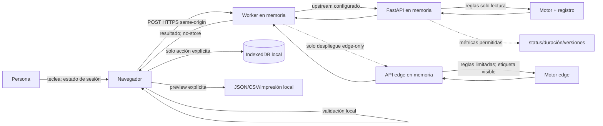

# Privacidad por diseño

## Resumen público

Cifra Cívica solicita datos fiscales únicamente para devolver la simulación que la persona inicia. No exige cuenta, no conserva el cuerpo en servidor, no crea un perfil, no infiere opinión política y no comparte entradas con partidos, campañas, anunciantes o analítica.

Antes de un lanzamiento real, la entidad operadora debe identificarse como responsable, publicar datos de contacto y base jurídica revisada, firmar contratos con proveedores y completar esta evaluación con su infraestructura. Este repositorio no inventa esa identidad ni sustituye asesoramiento jurídico.

## Propósito y exclusiones

Propósito: comparar de forma informativa reglas fiscales versionadas para el hogar introducido y mostrar contexto agregado independiente.

Excluido:

- filing, asesoramiento o decisión administrativa;
- intención de voto, ideología o afinidad;
- ranking/recomendación de partidos;
- publicidad, audiencia, lookalike o persuasión dirigida;
- encuesta de respuestas;
- reutilización para entrenamiento de modelos;
- venta o transferencia de entradas;
- combinación con identidad o navegación.

## Flujo

No hay camino desde ningún backend personal a pipelines, teselas, campañas o proveedores de analítica. El Worker no activa edge si un upstream configurado falla: devuelve un error seguro, evitando que disponibilidad cambie silenciosamente la implementación aplicada.

## Controles del navegador

- no enviar entradas en URL, referrer, título, filename o parámetros GET;
- autocompletado sensible revisado y mensajes que expliquen cada campo;
- estado en memoria por defecto;
- guardado local opt-in, etiqueta “en este dispositivo” y botón de borrado;
- no afirmar cifrado de IndexedDB;
- exportación con preview, importes redondeados y detalles de discapacidad/prestación excluidos por defecto;
- no incluir texto libre en el contrato personal;
- CSP sin trackers y conexiones salientes permitidas mínimas.
- ningún módulo de aritmética fiscal en los chunks del navegador; el cliente solo construye el contrato y presenta la respuesta.

## Controles del servidor

- ruta POST same-origin, esquema cerrado, límites de rango/tamaño y timeout;
- request ID aleatorio;
- `Cache-Control: no-store`;
- access logs sin query string ni body;
- excepciones y APM sin variables locales/cuerpo;
- no persistencia, cola, replay o caché de resultados;
- rate limit técnico efímero y no convertido en fingerprint;
- artefactos de políticas en solo lectura;
- despliegue sin logs de proxy de cuerpos.
- backend fijado por despliegue y comunicado como `python_api` o `edge_api`; nunca fallback de uno a otro tras un error.

## Logging permitido

Timestamp, request ID, endpoint normalizado, status, duración, backend/model version, scenario IDs y categoría gruesa de error. No se registra salario, pensión, renta, discapacidad, prestación, hogar, texto libre, respuesta ni municipio combinado con importes.

## Analítica

Desactivada por defecto. No hay publicidad, session replay, form recording ni political pixels. Una futura métrica de producto requiere decisión documentada, minimización, consentimiento cuando corresponda y prueba de que ninguna entrada/resultado llega al tercero. La opción preferida son contadores agregados propios sin identificadores.

## Derechos y solicitudes

Como el servidor no conserva simulaciones, normalmente no puede recuperar un cálculo por request ID. La operadora debe explicar esta limitación y atender los datos técnicos, feedback o incidentes que sí controle. El usuario borra guardado local desde la interfaz o almacenamiento de su navegador.

## Documentos vinculados

- [Evaluación de impacto](dpia.md)
- [Matriz de retención](retention-matrix.md)
- [Modelo de amenazas](../security/threat-model.md)
- [Terceros](../security/third-party-inventory.md)
- [Límites jurídicos y neutralidad](../governance/legal-neutrality.md)
