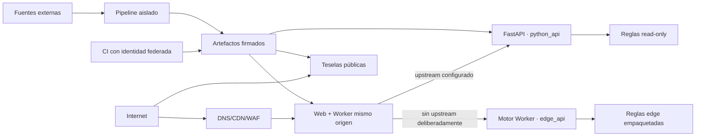

# Modelo de amenazas

## Alcance

Web pública, Worker del mismo origen, API de simulación, motores/registro, servicio de teselas, pipelines, CI/CD y artefactos. Fecha de revisión: 2026-07-13. Reabrir ante un nuevo tercero, campo, cuenta, IA, fuente restringida o arquitectura.

## Activos

1. Confidencialidad de entradas y resultados personales.
2. Integridad de reglas, fuentes, estados y metadatos.
3. Disponibilidad del cálculo durante interés electoral.
4. Neutralidad y ausencia de perfil político.
5. Integridad/supresión de agregados y mapas.
6. Secretos de build, firma y despliegue.
7. Reputación basada en trazabilidad, no en autoridad aparente.

## Adversarios y errores

- atacante externo oportunista o dirigido;
- actor que busca alterar una política o atribución;
- campaña que intenta convertir el producto en audiencia;
- dependencia/proveedor comprometido;
- contributor o operador con exceso de privilegios;
- error de configuración en proxy, logging, caché o storage;
- usuario que introduce payloads maliciosos o automatiza abuso.

## Fronteras

Los cuerpos personales solo cruzan navegador→perímetro→Worker→backend seleccionado y no entran en CI, pipelines, storage, métricas o teselas. Con upstream configurado, cualquier error falla cerrado; no deriva el cuerpo a `edge_api`. Sin upstream, edge-only es una decisión de despliegue visible, no un fallback por petición.

## Amenazas y controles

| ID | Amenaza | Control preventivo/detectivo |
| --- | --- | --- |
| T01 | XSS roba estado o guardado local | encoding/framework, CSP estricta, sin terceros, Trusted Types evaluado, tests |
| T02 | CSRF/abuso fuerza cálculos | métodos/Content-Type/origin según caso, sin cookies de auth, rate limit, tamaño/timeout |
| T03 | Inyección o deserialización | esquema cerrado, enums/rangos, sin eval, parámetros no interpolados |
| T04 | Body aparece en access/app/error/APM logs | allowlist estructurada, no access body/query, redacción, canarios CI |
| T05 | CDN/proxy cachea respuesta personal | POST + no-store, bypass de caché, test desde dos clientes |
| T06 | URL/export revela datos | no GET/share state, preview, nombres neutros, campos sensibles off |
| T07 | Fórmula/valor/fuente adulterado | revisión segregada, schema, casos, commit/hash, branch protection, firma/SBOM |
| T08 | Policy supply-chain / path traversal | artefacto read-only, IDs allowlist, no rutas del usuario, manifest |
| T09 | Reglas comunes aplicadas a foral | resolución previa, enum, pruebas negativas, fail closed |
| T10 | Escenario DEMO aparenta oficial | flag obligatorio, watermark, gate producción |
| T11 | Reidentificación en mapa | agregación offline, supresión, derivabilidad, no joins personales |
| T12 | DoS con escenarios/cuerpos grandes | máximo 3 comparadores, bytes/rangos, timeout, concurrencia y autoscaling |
| T13 | SSRF mediante URL de fuente | fuentes compiladas, fetch solo pipeline allowlisted; API no descarga URL del usuario |
| T14 | CSV injection | columnas fijas, strings sanitizados contra =,+,-,@, sin texto libre |
| T15 | Dependencia o Action comprometida | lockfiles, audit/SBOM, actions fijadas, Renovate/Dependabot con revisión |
| T16 | Secreto en Git/imagen/log | secret scan, multi-stage, .dockerignore, OIDC y secretos por entorno |
| T17 | Imagen escala privilegios | non-root, cap drop, no-new-privileges, read-only, base mínima |
| T18 | Tile/data artifact malicioso | checksum/schema/geometry tests, content types fijos, publicación separada |
| T19 | Manipulación política del orden/copy | plantilla simétrica, revisión editorial, changelog y feedback público |
| T20 | Fingerprinting/rate identifier reutilizado | TTL corto, no combinar, no analytics, cardinalidad controlada |
| T21 | Stack trace/ruta interna | error contract, prod debug off, pruebas de excepción |
| T22 | Compromiso de CI publica artefacto | permisos mínimos, environments, aprobación, provenance, rollback |
| T23 | Downgrade silencioso de `python_api` a un motor aproximado | backend fijado por despliegue, sin fallback por error, cabecera/etiqueta/metadatos coincidentes, E2E negativo |
| T24 | `SIMULATION_API_BASE_URL` alterada exfiltra bodies o habilita SSRF operativo | variable solo de despliegue, origen interno allowlisted, egress mínimo, revisión de configuración/provenance; ninguna URL del usuario |

## Casos de abuso

- enviar miles de escenarios: el contrato limita baseline + tres;
- usar municipio e ingreso para crear una audiencia: no se persiste ni exporta; endpoint no devuelve callback;
- publicar una propuesta sin detalles: schema/fuentes/metodología bloquean o crean variantes;
- inferir voto por escenario seleccionado: selections no se almacenan ni envían a analítica;
- sondear hogares con links personalizados: el estado no viaja en URL;
- reconstruir celdas suprimidas combinando capas: revisión de derivabilidad y versiones consistentes.

## Supuestos que deben validarse en despliegue

- TLS termina en un proveedor inventariado.
- Proxy/WAF no captura cuerpos o query strings completos.
- API y tile service no tienen acceso de escritura a artefactos.
- `SIMULATION_API_BASE_URL`, `X-Cifra-Engine`, metadatos y etiqueta visible coinciden con el modo aprobado.
- El proxy no sigue redirects ni puede derivar a una URL aportada por la persona usuaria.
- CI usa protección de rama y entornos.
- No hay un SDK de error que capture variables locales.
- Las cabeceras CSP, HSTS, nosniff, frame-ancestors/referrer/permissions están presentes.
- Relojes y metadatos de release son fiables.

## Riesgo residual

La herramienta será objetivo de escrutinio y posible DoS durante campaña. Una fuga individual mantiene impacto alto aunque la probabilidad se reduzca. La ambigüedad política y desfase normativo no se eliminan técnicamente; se gestionan con estados, revisión, versiones, advertencias y retirada rápida.
